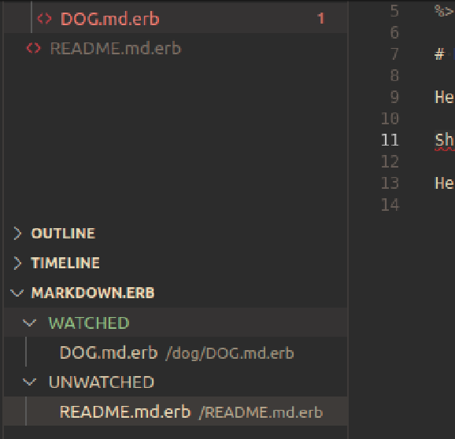
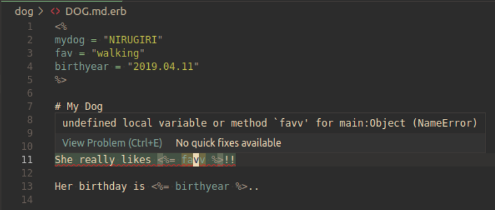

# Markdown.erb

Do you want to use VARIABLES when writing Markdown?

Then, this ***Markdown.erb*** is for you.

## What's this?

***Markdown.erb*** makes it easy for you to write markdown file in ERB.

There, you can use variables, repeat expression, or whatever else you can do in ERB.

## Features

### Easy erb compile

***Markdown.erb*** finds files with extension `.md.erb` in your workspace, and automatically compiles them into `.md` files while you are typing.

Of course, you can manage which files should be watched by ***Markdown.erb*** in `Explorer` sidebar in VSCode:

### Error diagnostic

You can easily notice error by ***Markdown.erb***'s error diagnostic. The diagnostic is shown in TextEditor both for syntax error and runtime error:

