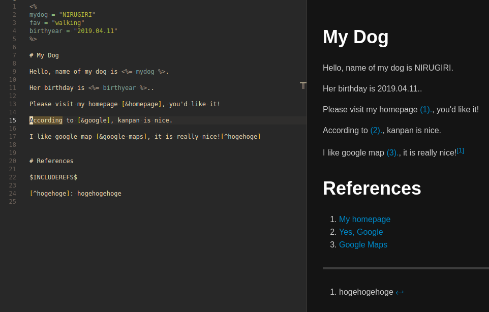
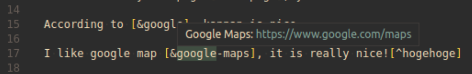

# Markdown.erb

Do you want to use VARIABLES when writing Markdown?

Then, this ***Markdown.erb*** is for you.


## What's this?

***Markdown.erb*** makes it easy for you to write markdown file in ERB.

There, you can use variables, repeat expression, or whatever else you can do in ERB.


## Install

***Markdown.erb*** is now not published on Visual Studio Marketplace. So you have to install it manually.

```bash
# For the detail of manual install from .vsix file,
# please refer to https://code.visualstudio.com/docs/editor/extension-marketplace#_install-from-a-vsix
wget https://github.com/smallkirby/Markdown.erb/releases/download/$VERSION/markdown-erb-$VERSION.vsix
code --install-extension markdown-erb-$VERSION.vsix
```

## Features

### Easy erb compile

***Markdown.erb*** finds files with extension `.md.erb` in your workspace, and automatically compiles them into `.md` files while you are typing.

Of course, you can manage which files should be watched by ***Markdown.erb*** in `Explorer` sidebar in VSCode:


### Error diagnostic

You can easily notice error by ***Markdown.erb***'s error diagnostic. The diagnostic is shown in TextEditor both for syntax error and runtime error:


### Simple pre-processor for easy reference

Footnote expression of Markdown (`[^foot]`) is really useful. If you want to apply it to References in the same way, ***Markdown.erb*** works for you.

You can create `refs.mderb.json` JSON file in the same directory with your `.erb.md` file to define your references (like BibTex file).

```json
[
  {
    "text": "My homepage",
    "ref": "https://smallkirby.xyz",
    "alias": "homepage"
  },
  {
    "text": "Yes, Google",
    "ref": "https://google.com",
    "alias": "google"
  },
  {
    "text": "Google Maps",
    "ref": "https://www.google.com/maps",
    "alias": "google-maps"
  }
]
```

Then, you can cite them in your Markdown by using `[&reference-alias]` syntax:

```markdown
Please visit my homepage [&homepage], you'd like it!
```

It would be pre-processed by ***Markdown.erb*** and transpiled like below:



#### Hover diagnostic of your reference

You can check the expanded value of your reference in hover window:



